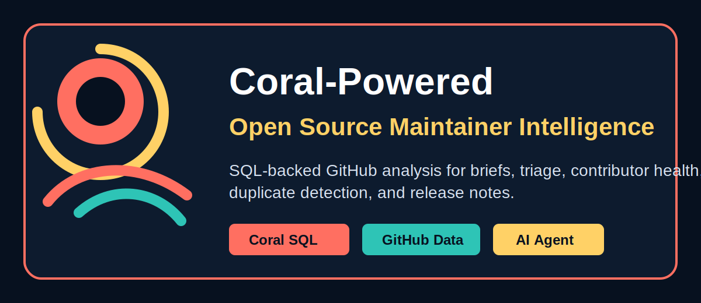

# OS First Mate

OS First Mate is an AI command center for open source maintainers. It analyzes GitHub repositories and helps maintainers generate daily briefs, triage issues, detect duplicate reports, understand contributor health, and prepare release notes.



Built for the Coral hackathon, the app puts Coral at the center of the product: repository intelligence is fetched through Coral SQL tools, then synthesized by an AI agent into practical maintainer workflows.

## Features

- **Coral-powered repository intelligence**: Queries GitHub issues, pull requests, releases, labels, and contributor activity through Coral SQL.
- **Repository brief**: Summarizes project health, urgent issues, duplicate risks, contributor risks, release candidates, and recommended actions.
- **Issue triage**: Suggests labels, priority, assignees, reasoning, evidence, and next steps for open issues.
- **Contributor health**: Surfaces bus factor, top contributors, rising contributors, bottlenecks, and burnout signals.
- **Release notes**: Generates structured release notes from merged pull requests and recent releases.
- **Duplicate detection**: Compares an issue against existing open and closed issues to find likely duplicates.
- **GitHub authentication**: Uses NextAuth with GitHub OAuth.

## Tech Stack

- [Next.js](https://nextjs.org/) App Router
- [React](https://react.dev/)
- [TypeScript](https://www.typescriptlang.org/)
- [NextAuth](https://authjs.dev/) with GitHub OAuth
- [OpenAI API](https://platform.openai.com/)
- Coral CLI for SQL-backed GitHub data access
- GitHub REST API fallback

## Why Coral

OS First Mate treats Coral as the data layer for maintainer automation. Instead of hardcoding one-off GitHub API calls into every workflow, the agent uses Coral SQL tools to ask structured questions over repository data:

- Which open issues need triage?
- Which labels exist in this repository?
- Which closed issues reveal historical labeling patterns?
- Which pull requests should become release notes?
- Which contributors are carrying most of the project load?

This makes the product feel like a maintainer analyst sitting on top of live GitHub data, with Coral providing the queryable foundation.

## Project Structure

```text
src/
  app/                 Next.js routes, API handlers, layout, and global styles
  components/shared/   Reusable UI components shared across features
  features/            Product features grouped by domain
  hooks/               Client-side React hooks
  server/              Server-only auth, OpenAI, and agent logic
  server/github/       GitHub and Coral tool execution
  types/               Shared cross-feature TypeScript types
```

Feature-specific components and types are colocated under `src/features`. Next.js route files stay under `src/app`.

## Getting Started

Install dependencies:

```bash
npm install
```

Create a `.env.local` file:

```bash
OPENAI_API_KEY=
GITHUB_ID=
GITHUB_SECRET=
GITHUB_TOKEN=
NEXTAUTH_SECRET=
NEXTAUTH_URL=http://localhost:3000
CORAL_BIN=/opt/homebrew/bin/coral
```

Run the development server:

```bash
npm run dev
```

Open `http://localhost:3000`.

## Environment Variables

| Variable | Required | Description |
| --- | --- | --- |
| `OPENAI_API_KEY` | Yes | API key used for AI analysis and generation. |
| `GITHUB_ID` | Yes | GitHub OAuth app client ID for NextAuth. |
| `GITHUB_SECRET` | Yes | GitHub OAuth app client secret for NextAuth. |
| `NEXTAUTH_SECRET` | Yes | Secret used by NextAuth to sign tokens. |
| `NEXTAUTH_URL` | Yes | Base URL for local or deployed auth callbacks. |
| `GITHUB_TOKEN` | Recommended | Token used for GitHub REST fallback requests. |
| `CORAL_BIN` | Optional | Path to the Coral binary. Defaults to `/opt/homebrew/bin/coral`. |

## Scripts

```bash
npm run dev      # Start the development server
npm run build    # Create a production build
npm run start    # Start the production server
npm run lint     # Run ESLint
```

## Data Flow

1. A maintainer selects a GitHub repository.
2. The dashboard calls feature-specific API routes under `src/app/api`.
3. API routes execute Coral-backed GitHub tools from `src/server/github`.
4. Coral SQL returns structured repository data.
5. OpenAI synthesizes the gathered data into maintainer-ready results.
6. Feature panels render the results with live agent steps and query evidence.

## Notes

- Coral is used when available for SQL-backed repository queries.
- GitHub REST fallback keeps supported workflows usable when Coral is unavailable.
- `.superpowers/`, local environment files, build output, and dependencies are ignored by Git.
